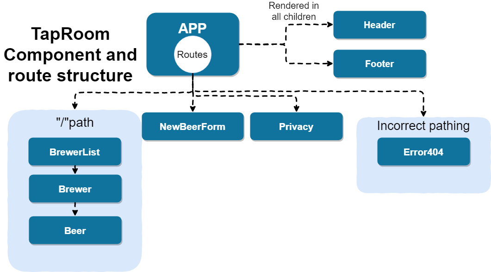

# Tap Room

#### _An application that shows a variety of beers/beers from various brewers in a clientside React application. - September 6 2019_

#### _By **Erik Irgens**_

## Description

This application is for a Tap Room website, which is meant to display many beer options from several different brewers, as well as add new beers to the list of brewers by using a stateful component, through a form. This app, in this iteration, is intended to introduce the concepts of React and the component model into a client side app with state. 

### Specs
| Spec | Input | Output |
| :-------------     | :------------- | :------------- |
| **User can view the main page** | Visit "/" path | Beer is displayed by category of brewer  |
| **User can use the navigation page to view all brewers** | Visit "/brewersList" path | A list of brewers will appear  |
| **User can visit individual brewers' page for their beers only** | Visit "/brewersList/{brewer}" path | A list of brewer's beers will appear  |
| **User can create a new beer** | Visit "/newbeerform" path | User can enter information into form and submit  |
| **User can see the new beer they have added** | Visit "/brewersList" path | User can now see new beer under the brewer they selected  |


### Component Diagram and Pathing



## Setup/Installation Requirements

1. Clone this repository:
    ```
    $ git clone https://github.com/erik-t-irgens/TapRoom
    ```
2. Install the dependencies
    ```
    $ npm install
    ```
3. Run the application in the root directory
    ```
    $ npm run
    ```
4. Visit the MVC localhost:8080/
    ```
    localhost:8080/
    ```

## Known Bugs
* The listed beers on the Brewers page should not be aligned to the bottom of their element. I'm not sure why they are aligned in such a way.

## Technologies Used
* JavaScript, CSS, HTML, React

## Support and contact details

_Please contact Erik Irgens with questions and comments._

### License

*GNU GPLv3*

Copyright (c) 2019 **_Erik Irgens_**
